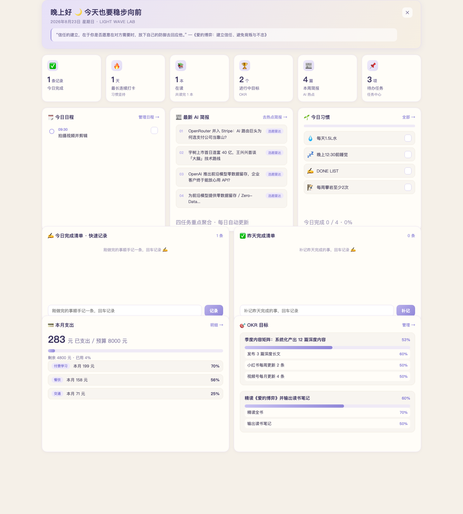
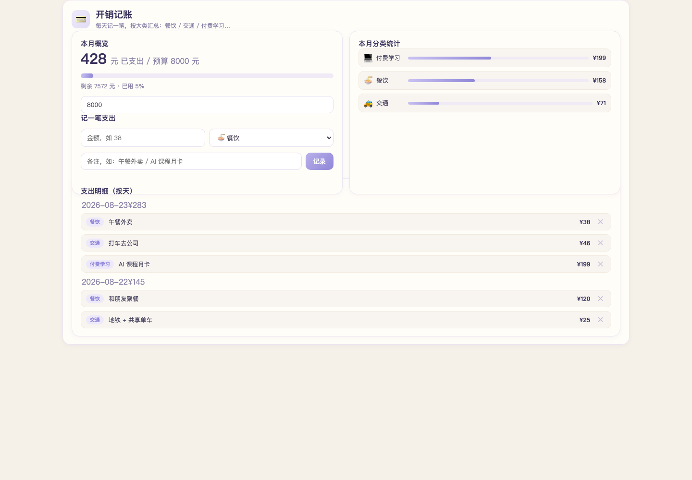
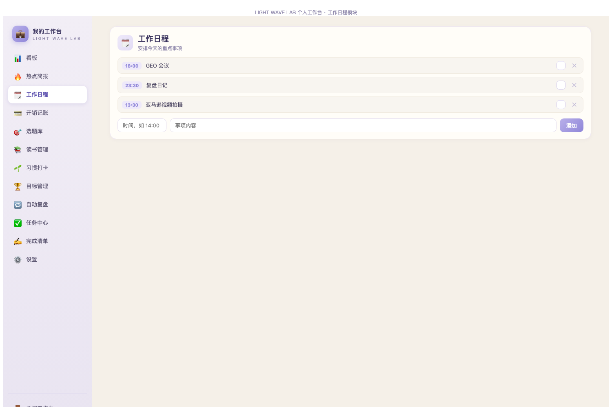

# LIGHT WAVE LAB · 个人工作台

一个好看实用的个人工作台插件，运行在 **DSH (DeepSeek Harness) Web GUI** 内。
设计参考「LIGHT WAVE LAB」暖奶油 × 淡薰衣草配色，开箱即用。

## 🖼 效果预览

> 静态预览页（真实数据渲染，双击打开即可浏览，无需安装）：
> [`preview-board.html`](./preview-board.html) · [`preview-budget.html`](./preview-budget.html) · [`preview-schedule.html`](./preview-schedule.html)

| 看板首页 | 工作日程模块 | 习惯打卡模块 |
|---|---|---|
|  |  |  |

## ✨ 功能

- **看板首页**：早安横幅（问候语 + 日期 + 每日一句）、KPI 卡片、今日日程（时间线）、最新 AI 简报、今日习惯（进度条）、今日完成清单（快速记录）、昨日补记、本月预算、OKR 目标进度（含 KR 明细）、待办任务
- **12 个模块全部可用**：
  - 看板（总览）/ 热点简报（收录 AI 热点）/ 工作日程 / 开销记账 / 选题库（待写→写作中→已发布）/ 读书管理（想读→在读→读完 + 进度）/ 习惯打卡 / 目标管理（OKR：O 目标不写数字，KR 关键结果写具体数字，O 进度 = KR 平均）/ 自动复盘（一键生成）/ 任务中心（优先级排序）/ 完成清单 / 设置（名称 + 4 主题 + 导出 + 重置）
- **数据持久化**：所有记录经 Host 写入 `{workspace}/.dsh-workbench.json`，刷新不丢；跨天自动把未完成事项滚动到「昨天」
- **多入口**：右下角悬浮按钮（避开 dsh-pet 小奶龙）+ 侧边栏底部 + 会话头部

## 📦 安装

### 方式 A：复制即用（零构建，推荐）

本仓库是「复制即用」形态，无需打包。在 DSH Web GUI 中：

1. 让 agent 用动态插件功能（`cordis_define`）创建一个新插件，`idPrefix` 填 `wbench`：
   - `code.host` ← 粘贴 [`host.js`](./host.js) 内容
   - `code.client` ← 粘贴 [`client.js`](./client.js) 内容（动态插件版，走 `host.call` RPC）
2. `cordis_run` 激活并批准
3. 侧边栏底部 / 会话头部 / 右下角会出现「💼 工作台」入口

### 方式 B：标准挂载（webServer 版）

适用于挂载到 web profile 的 `cordis.patch.yml`（重启不丢）：

- Host：`src/index.ts`（提供 `/api/workbench/*` HTTP 接口 + serve client + 注入脚本）
- Client：`client-std.js`（fetch 版，配合方式 B 的 HTTP API）
- 在 `~/.dsh/profiles/web/cordis.patch.yml` 加一行：
  ```yaml
  - insert:
      - id: workbench
        name: '/绝对路径/dsh-workbench/src/index.ts'
  ```
  重启 web 后常驻生效。注意：方式 B 的 client 依赖页面能解析 React 的标准 client bundle 机制，若直接 serve 裸 JS 无法渲染 UI，需要按 DSH 客户端插件规范（`dsh.client` 声明 + tsdown 构建）产出标准 bundle。

## 🛠 使用

1. 点击任意「💼 工作台」入口打开全屏工作台
2. 看板直接操作：
   - **今日完成 / 昨日补记**：输入文字回车即记录，可勾选 / 删除
   - **今日习惯 / 今日日程**：勾选完成，✕ 删除
   - **本月预算**：输入总额与已支出，进度条实时更新
3. 左侧导航切换各模块页（日程 / 习惯 / 预算 / 目标 / 完成清单 / 简报 / 选题 / 读书 / 复盘 / 任务 / 设置均有完整管理界面）
4. 设置页可：改工作台名称（侧栏同步）、切换 4 种主题（薰衣草/薄荷/蜜桃/海洋）、导出全部数据到 JSON、重置为默认数据

## 📁 数据文件

- 路径：`{workspace}/.dsh-workbench.json`
- 内容：`dateKey`、`tasks`（按日期分组的完成清单）、`habits`、`schedule`、`briefings`、`budget`、`goals`、`topics`（选题库）、`bookList`（读书管理）、`reviews`（复盘）、`centerTasks`（任务中心）、`settings`（名称/主题）、`books`、`streak`、`quote`
- 备份 / 迁移：直接复制该 JSON 文件即可

## 🔧 常见调整

- **配色**：`client.js` 顶部 CSS 中的色值（`#f5f0e8` 背景、`#8f86d8` 主题紫、`#38315c` 深色文字）；或设置页直接切主题
- **悬浮按钮位置**：`client.js` 中 `.wb-fab` 的 `right` / `bottom`（当前 `right:18px; bottom:210px`，为避开 dsh-pet 小奶龙而抬高）
- **默认数据**：`host.js` 的 `defaults()` 函数（默认习惯、简报、预算、目标、选题、书籍、任务等）
- **KPI 卡片**：`client.js` 的 `BoardPage` 中 `kpis` 数组，增删卡片即可

## 📄 License

Apache-2.0

## 🙌 致谢

- 界面设计灵感：LIGHT WAVE LAB 工作台概念稿
- 运行环境：[DSH (DeepSeek Harness)](https://github.com/deepseek-ai/dsh)
